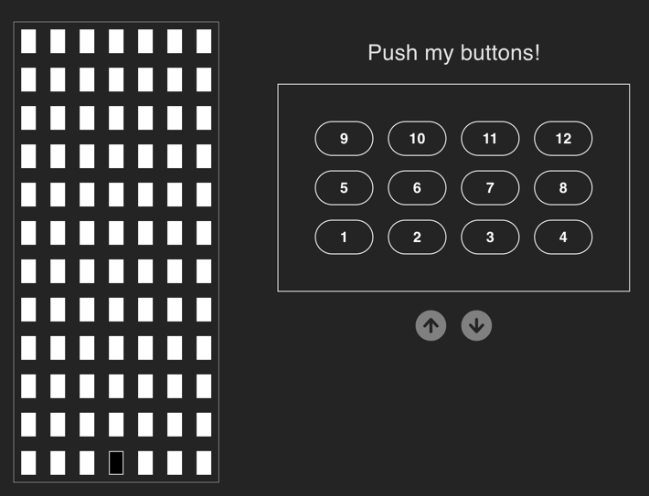

# Elevator Game!

This project simulates a building elevator. It displays a building on the left and a button panel on the right.
The elevator will respond to button clicks after a short delay. The delay is there to simuate a real elevator and 
allow the user to press a few buttons before the elevator takes off. The elevator will then try to move in one 
direction and exhaust all requests in that direction before turning in the opposite direction and completing
those requests. You can play with this by selecting a few floors like 6,7,11,12 and then when the elevator
starts moving try adding 1,2,3 to the list. 

There are a series of unit tests that allow you to try different sorting algorithms and will return an `ElevatorStat` object
which contains the current floor, ordered list of destinations and the total time it will take to complete the requests. 
```
{
      currentFloor: 1,
      destinations: [2, 4, 6, 7, 8,12, 15, 19, 20, 24],
      totalTime: 230
    }
```

This project is built with `yarn | vite | React | Typescript` 

## Build
To start the web app you should be able to do a `yarn install` followed by `yarn dev`. Then open a browser to `http://localhost:5173/`

## Tests
The tests can be run from the command line or from your IDE. They are located in `src/ElevatorReducer.test.ts`
`yarn run test` will run them from the command line.

## Code
This React/TypeScript project was built relying heavily on the `useReducer` React Hook as a state machine. I did this
because state management can often be difficult in React apps and I wanted to see how I could effectively build
a game with the core of it using a state machine. I think it worked well for the most part. I was able to centralize my
logic in the state machine and in those code blocks I was able to contextualize what was happening in the app at that moment.

## The Game



